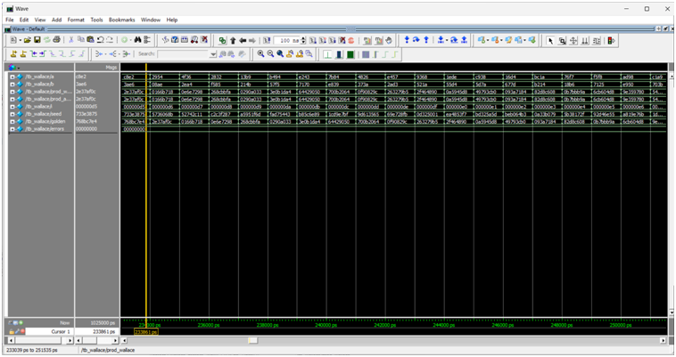
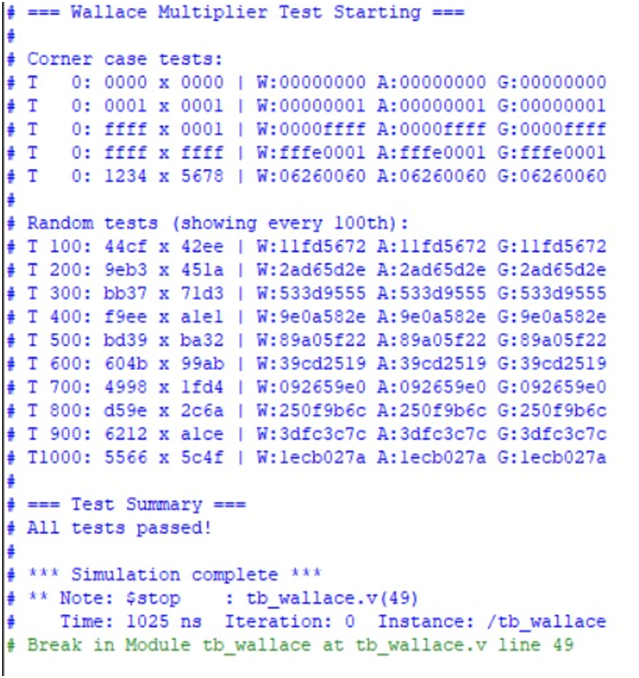

# Wallace Tree Multiplier (16×16)

## Overview
This project implements a high-speed 16×16 Wallace Tree Multiplier in Verilog HDL. The design uses carry-save adders for parallel partial-product reduction, significantly reducing propagation delay compared to a conventional Array Multiplier. The implementation focuses on speed optimization while maintaining full functional correctness.

## Features
- Structural Wallace Tree architecture
- Parallel carry-save reduction of partial products
- Modular design using Half Adder (HA) and Full Adder (FA) blocks
- Behavioral Array Multiplier implemented for comparison
- Verified using corner cases and 1000+ random test vectors
- Simulated using ModelSim (Intel FPGA Starter Edition)

## Design Highlights
- Partial products generated using bitwise AND operations
- Iterative 3:2 carry-save reduction to minimize addition levels
- Final carry-propagate addition stage for accurate output
- Reduced critical path delay compared to array multiplication
- Parameterized and scalable Verilog design

## Verification Strategy
- Self-checking testbench with golden reference model
- Corner case testing (0×0, max values, typical inputs)
- 1000+ randomized test cases for robustness
- Output comparison between Wallace Tree Multiplier, Array Multiplier, and golden reference
- All test cases passed with 100% functional correctness

## Tools & Technologies
- Verilog HDL
- ModelSim (Intel FPGA Starter Edition)

## Applications
- Digital Signal Processing (DSP)
- VLSI arithmetic and ALU design
- High-speed computing systems
- AI and signal processing hardware accelerators

## Conclusion
The 16×16 Wallace Tree Multiplier was successfully designed, implemented, and verified. Simulation results confirm accurate functionality and improved timing performance compared to a conventional Array Multiplier. This project demonstrates a complete VLSI design flow including architecture selection, HDL implementation, simulation, and verification.
## Simulation Results

### ModelSim Workspace

### Waveform Verification

### Final Test Results

